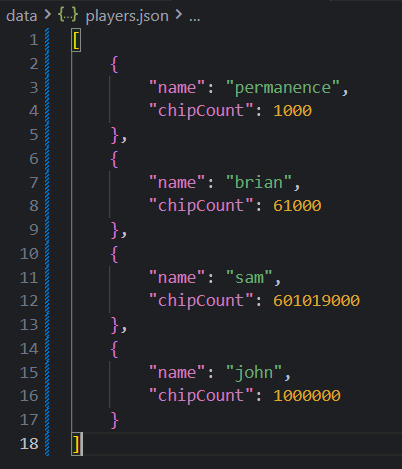
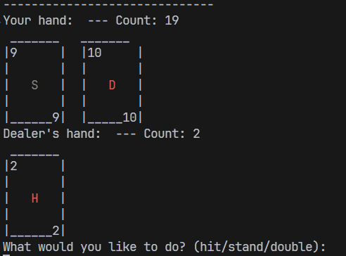
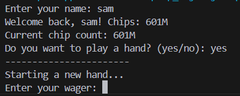

# Blackjack CLI Game

## A simple command-line blackjack game in Java featuring:

- Persistent player chip balances saved in JSON

- Dynamic player selection by name

- Classic blackjack rules with hitting, standing, dealer logic

- Wagering system with chip tracking

- Testing wth JUnit5

## Features

- Load and save player profiles with chip counts

- Start a new hand or continue playing

- Validates wagers against current chip balance

- Handles blackjack, busts, and pushes correctly

- Supports multiple hits with accurate Ace value adjustment

- Dealer hits until 17 or higher

## JSON Persistence

Player data is stored in a JSON file (```players.json```) in the project root. The game reads and updates chip balances automatically.

## How to run?

### Option 1: Run the Prebuilt JAR (Recommended)

1. Make sure you have Java 22+ installed.

```bash
java -version
```
2. In the project root directory, run:

```bash
java -jar blackjack.jar
```
Then the game will launch in a terminal window!

### Option 2: Build From Source

If you want to build the project yourself:

1. Make sure you have:

Java 22+ and the libs/ folder (contains Gson)

2. Run the batch file:

```bash
./build.bat
```

3. After it finishes, start the game with:

```bash
java -jar blackjack.jar
```

## Testing

This project uses **JUnit 5** to test game logic.

### Running Tests

1. Make sure the JUnit standalone jar is in the `libs/` folder: ```libs/junit-platform-console-standalone-1.14.2.jar```


2. Compile all source and test files into the `bin/` folder:

```javac -cp "libs/*" -d bin src/*.java test/*.java```

3. Run all tests using the JUnit console launcher:


```java -jar libs/junit-platform-console-standalone-1.14.2.jar -cp bin --scan-class-path```

You should see output indicating which tests passed or failed.


## Screenshots
<div style="align-items: center; display: flex; gap: 10px; justify-content: center;"> 
     
     
     
</div>


### Any potential errors


Make to to have your .vscode/settings.json to have access to the project. Make sure it looks something like this. 

```bash
{
    "java.project.sourcePaths": [
        "src",
        "test"
    ],
    "java.project.referencedLibraries": [
        "libs\\gson-2.10.1.jar",
        "libs\\junit-platform-console-standalone-1.14.2.jar"
    ],
    
}
```
